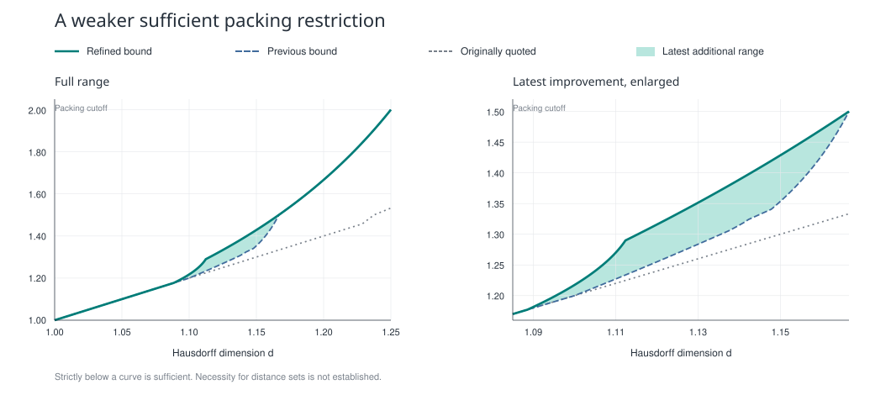

# A Hausdorff–packing criterion for self-pinned distance sets

**Start here: [focused theorem and proof PDF](docs/falconer-human/falconer-packing-theorem.pdf).**
The [short guide](docs/falconer-human/README.md) states the condition and gives a graph.
The PDF puts the explanation and main proof first, followed by the detailed estimates.

A Lean 4 formalization project for Theorem 1.1 of the focused proof PDF above.
The current target is the unconditional theorem with the stronger boundary below.
**The full Lean proof passes the independent comparator and clean build, using only
`propext`, `Classical.choice`, and `Quot.sound`.**
[Verified GitHub run](https://github.com/CoolRmal/falconer-packing/actions/runs/36824796497).

**Research archive, 30 September 2026.** The [longer proof manuscript](docs/packing-unforced/packing-unforced-proof.pdf)
gives the explicit stronger cutoff

$$
B_{\mathrm H}(d)=
\begin{cases}
2d-1,&1<d\le d_\alpha,\\[6pt]
1+r_2(d-1),&d_\alpha<d\le d_c,\\[6pt]
\dfrac1{3-2d},&d_c<d\le\dfrac54,
\end{cases}
$$

$$
d_\alpha=\frac{7-\sqrt7}{4}\approx1.088562172,
\qquad d_c=\frac{2+\sqrt6}{4}\approx1.112372436.
$$

The middle branch is the explicit radical

$$
r_2(a)=\frac{2-a+8a^2-\sqrt{4-28a-63a^2+32a^3+64a^4}}
{4(1+4a-2a^2)}.
$$

For a Borel planar set, packing dimension strictly below this curve implies a
positive-length pinned distance set for some pin in the set. The
[full statement and proof](docs/packing-unforced/README.md) include the exact joins
and all strict endpoint conditions.

New examples include Hausdorff dimension 1.09 with packing dimension 1.181, and
Hausdorff dimension 1.15 with packing dimension 1.40. At Hausdorff dimension 1.10,
the exact cutoff is 28/23; at dimension 1.15 it is 10/7.

There is now an additional **endpoint class with a quantitative covering
assumption**. If a compact set carries an s-Frostman probability and its
occupied-square count satisfies

$$
N_n\le C\,2^{n(2s-1)}e^{-c\sqrt n},\qquad 1<s<2,
$$

then its raw joint distance law is absolutely continuous for any compact pin
Frostman probability of exponent greater than one. In particular it has
positive-length distances for almost every self-pin under that source measure.
The manuscript constructs examples with

$$
0<\mathcal H^{21/20}(K)<\infty,\qquad
\dim_H K=\frac{21}{20},\qquad \dim_P K=\frac{11}{10}.
$$

No subset of these examples satisfies the earlier strict dimension condition,
and no positive-dimensional subset has equal Hausdorff and packing dimensions.
The extra covering margin is proved for the examples; dimension equality alone
is not asserted sufficient. The dimension-only curve above is unchanged.

The direct frequency-band proof now removes the logarithmic loss in the
covering summability test. The manuscript also incorporates the earlier
selected-scale family, with positive-length self-pinned distances at
Hausdorff dimension 21/20 and packing dimension 6/5, and up to 84/61 in that
constructed class. Those examples have additional scale structure; their two
dimensions alone are not claimed sufficient for an arbitrary set.

Using the actual common angular tails now weakens the convergence test again:
it admits a critical polynomial covering margin with logarithmic exponent
greater than two. The proof chooses one family of centers for all scales.
A separate construction shows that finite positive critical Hausdorff and
packing measures cannot by themselves force this curvature-energy test,
even after changing the source or the selected global scales. These are
statements about sufficient estimates, not distance-set counterexamples.



Matching profiles prove this curve is optimal for the specified combination of
the coherent test and the limiting universal chain-cost test. They are not planar
distance-set counterexamples: the weakest possible dimensional condition for the
distance theorem remains unknown. The focused dimension theorem now has a complete
Lean proof; the other research claims are not all formalized. The original curve below is preserved.

The [new algebra module](FalconerPacking/HardGapAlgebra.lean) now verifies both
weighted certificates and five supporting algebraic statements with only the
three standard axioms. The manuscript also proves that matching profiles recur
in a single Frostman measure and that optimizing the finite starting depth does
not improve this profile criterion. These are limitations of specific methods,
not distance-set counterexamples.

The [earlier forced-midpoint refinements](docs/packing-refinement/README.md) remain
available with their proofs and audits.

The latest natural-language proof also strengthens the conclusion under the same
curve: selected separated source and pin probabilities have a **raw joint
distance density whose pth power is integrable for some exponent greater than
one**. The proof treats
both analytic branches and explicitly handles the pin mass discarded in finite
regularization. This improves integrability without changing the dimension
cutoff. The focused dimension theorem is formalized; this stronger integrability
conclusion is a separate natural-language result.

The latest addition also proves an exact limitation of a local refined-decoupling
construction: optimizing its terminal scale and every weighted exponent from
two to six gives exactly the original optimized chain cost. The proof holds for
every 1-Lipschitz profile, not just the examples used to test the curve. This
particular construction therefore does not weaken the dimension condition.

The geometric selection argument now gives an optimal deletion order for the
averaged quadratic norm in the finite train-track model. Its proof counts the
actual arithmetic resonances of the pin slats. A fixed angular selection also
gives a summable near-source collision bound, and a separate reflection
mixed-norm criterion gives another precise route to pinned densities. The
remaining hypotheses of these two general criteria have not been proved from
dimensions beyond the curve above.

A fixed recursive example now shows a stronger limitation of the bisector
route: against the constructed probability used as pins on the same set, **no nonzero positive source measure on
the constructed support** has a raw joint weak-Lq density for q greater than
9/8. Its Hausdorff and packing dimensions are 11/10 and 13/11, inside the
proved positive-distance region. The norm failure occurs even on a fixed
radial interval bounded away from zero. Thus choosing a different source measure
alone cannot supply the proposed quadratic bisector hypothesis. This is a
norm obstruction, not a counterexample to positive-length distances.

The new positive-selection reduction weakens the analytic target: at arbitrarily
fine scales, it suffices that a fixed positive mass of source–pin pairs has
bounded normalized far-annulus crowding. The proof gives a nonzero absolutely
continuous component and a quantitative positive-length conclusion. A
logarithmic crowding moment gives an integrable entropy density; a fractional
moment gives an integrable power greater than one. The dimension cutoff is
unchanged: the required crowding bounds remain to be proved in a larger region.

For a Borel set $E \subseteq \mathbb{R}^2$ write $\Delta_y(E) = \{|x-y| : x \in E\}$, put

$$d_0 = \frac{9+\sqrt{33}}{12}, \qquad d_1 = \frac{5+\sqrt{97}}{12},$$

and define, for $1 < d \le 5/4$,

$$
B(d) =
\begin{cases}
2d-1,
  & 1 < d \le d_0, \\[4pt]
3d^2 - \dfrac52 d,
  & d_0 < d \le d_1, \\[8pt]
\dfrac{(2d-1)^2 + \sqrt{(2d-1)^4+8d}}{4},
  & d_1 < d \le \dfrac54.
\end{cases}
$$


**Theorem 1.1.** If $E \subseteq \mathbb{R}^2$ is Borel, $d = \dim_H E \in (1, 5/4]$ and
$\dim_P E < B(d)$, then $|\Delta_y(E)| > 0$ for some $y \in E$.

The pin lies in $E$ itself, no compactness or regularity is assumed, and the packing inequality
is strict, including at the two transition points.

## Status

The comparator now targets `FalconerPacking.exists_pin_volume_pinnedDistances_pos`, the
unconditional statement of Theorem 1.1 in the focused PDF, with `hausdorffPackingBound`.
`Challenge.lean` independently states that exact target. Its theorem hole is a specification,
not a proof; it is never imported by the solution library.

`Solution.lean` imports the complete unconditional proof from
[`HausdorffPackingTheorem.lean`](FalconerPacking/HausdorffPackingTheorem.lean).
The exact target builds and its transitive axiom audit returns only `propext`,
`Classical.choice`, and `Quot.sound`. The independent comparator and clean build
[passed on 1 October 2026](https://github.com/CoolRmal/falconer-packing/actions/runs/36824796497)
at proof commit [`34c7c95`](https://github.com/CoolRmal/falconer-packing/commit/34c7c95d82dc85bb2c166f64c2a36700b1bb0ca4).
The comparator rebuilt the solution on a fresh Linux runner inside its sandbox,
compared the theorem and its recursive definition dependencies, checked the permitted
axioms, and reported: `Lean default kernel accepts the solution`.

The proof includes Borel Frostman extraction, averaged radial densities, hard-gap profile
chains, actual retained wave packets and their Fourier tails, weighted Fourier iteration,
the pinned quadratic identity, and the final absolute-continuity argument. No analytic
criterion is left as a hypothesis of the final theorem.

| stage | state |
|---|---|
| exact focused-PDF challenge statement | type-checks; unconditional proof provided separately |
| historical branch combination (Section 4 of the earlier manuscript) | **proved**, with explicit analytic assumptions |
| curve algebra (transition points, monotone branches) | **proved**, no holes |
| new hard-gap weighted certificates, threshold algebra, and exact margins | **proved**, seven theorems, standard axioms only |
| focused-PDF curve: joins, continuity, exact examples, strict exponents, middle-branch root inequality | **proved**, standard axioms only |
| dimensions: `dimH ≤ packingDim`, monotonicity, countable stability | **proved**, no holes |
| profile: Lemma 3.2 (chain to the origin), Lemma 3.3 (endpoint estimate) | **proved**, no holes |
| dyadic cubes: partition, nesting, ancestors, diameter, four-cube bound | **proved**, no holes |
| energy: Frostman measures have no atoms and finite `a`-energy for `a < s` | **proved**, no holes |
| restrictions, selection, separation, Hausdorff content | **proved**, no holes |
| **finite Frostman lemma**: allowances hold and total mass dominates the content | **proved**, no holes |
| compact occupied-cube covers and normalized atomic Frostman measures | **proved**, no holes |
| weak compactness, supported subsequence extraction, and dyadic Frostman bounds in the limit | **proved**, no holes |
| compact Frostman lemma: positive content or larger Hausdorff dimension gives an all-radius Frostman probability | **proved**, no holes |
| compact source and pin reduction: separated probabilities with Frostman and covering bounds | **proved**, including arbitrary-Borel initial Frostman extraction |
| unforced profile operations: merging, clipping, and fixed-chain perturbation | **proved**, standard axioms only |
| arbitrary-chain compression to uniformly bounded length, with no cost increase | **proved**, standard axioms only |
| discrete profile interpolation, normalization, and exact minimum/cost compatibility | **proved**, standard axioms only |
| planar Gaussian Fourier energy identity and its Fubini justification | **proved**, standard axioms only |
| compact Frostman-family capacity and the mass-distribution principle | **proved**, standard axioms only |
| high-slope profile: sharp chain cost and uniformly bounded length | **proved**, standard axioms only |
| exact scalar bridge from the focused-PDF cutoff to profile certificates | **proved**, standard axioms only |
| compact extraction and Frostman probabilities for arbitrary planar Borel sets above dimension one | **proved**, using dyadic capacity and Hausdorff-content comparisons |
| increasing-union continuity for actual dyadic covering content | **proved**, for arbitrary sets and cube weights |
| finite-grid hard-gap chain theorem, including endpoint clipping and barrier errors | **proved**, with uniform chain length and standard axioms only |
| strict cutoff gives uniformly short profile chains with cost strictly below $$(s-1)N$$ | **proved**, with positive error tolerance and a profile-independent starting scale |
| absolute continuity of weak limits under uniform L² density bounds | **proved**, by Hölder, Portmanteau, and outer regularity |
| Fourier energy in frequency balls grows at most as $$R^{2-s}$$ | **proved**, directly from Frostman growth |
| angular Fourier band bounds and summed positive-frequency integrability | **proved**, using polar coordinates and the Frostman exponent above one |
| Schwartz L² test bounds imply absolute continuity of finite real measures | **proved**, including the exact square-root open-set estimate |
| square-integrable characteristic functions yield actual nonnegative L² densities | **proved**, with the exact Plancherel energy identity |
| almost every orthogonal projection of a Frostman probability above exponent one has an L² density | **proved**, by polar integration and Fourier inversion |
| projection densities can be chosen jointly measurably in angle and position | **proved**, with the joint measure identity |
| short correlated angular increments are controlled by averaged squared derivatives | **proved**, by the fundamental theorem of calculus, Hölder, and the marginal bound |
| correlated Fourier translation estimates over frequency bands | **proved**, allowing the direction and shift to depend on the same pin |
| finite regular decomposition of original dyadic measure restrictions | **proved**, including normalized probabilities, discarded mass, component mass, and count bounds |
| radial pushforward kernels and the weighted angular singularity estimate | **proved**, including actual averaged radial densities with a moment above one |
| angular energy estimate for actual orthogonal pushforward measures | **proved**, without assuming a transversality estimate |
| Fourier band energy of the actual angular derivative | **proved**, using signed coordinate transforms and bounded source support |
| two-sided dyadic band sum with the sharp displacement power | **proved**, for the full range $$1<s<3$$ |
| ordered hard/gap partitions of actual interpolated profiles | **proved**, with no partition assumption |
| real-chain compression to uniformly bounded length | **proved**, without cost increase |
| Gaussian spatial and Fourier growth bounds from the Frostman condition | **proved**, standard axioms only |
| finite hard-interval representation of actual interpolated profiles | **proved**, standard axioms only |
| finite admissible real chains across hard intervals and gaps | **proved**, including ordered-partition extraction and grid rounding |
| signed Gaussian energy and the coordinate-weight comparison | **proved**, including almost-everywhere source bounds |
| finite gap tails, telescoping, and bridges to the two cost certificates | **proved**, including hard-set extraction and chain construction |
| fixed dyadic centers with controlled mass-weighted moments | **proved**, standard axioms only |
| common truncation of correlated angular densities and discarded-mass bound | **proved**, standard axioms only |
| hard-point set: compactness and gap-drop geometry | **proved**, standard axioms only |
| initial Frostman extraction for sigma-compact sets and finite Hausdorff-measure pieces | **proved**; arbitrary-Borel extraction is proved separately |
| pinned pushforward: absolute continuity or a displayed density implies positive-length pinned distances | **proved**, no holes |
| localized conditional-energy bounds and full-measure finite conditioning families | **proved**, no holes |
| $$u<2s-1$$ gives powered conditional-energy summability and convergence from a first-norm comparison | **proved**, no holes |
| positive `L¹` density limits, weak identification, affine-map limits, and absolute continuity | **proved**, no holes |
| coherent joint approximation: summable `L¹` densities and affine-map convergence give joint absolute continuity and a positive-length pin | **proved**, no holes |
| affine distance geometry: measurability and the quadratic error bound under positive source–pin separation | **proved**, no holes |
| compact dyadic source centers: measurable selectors with a uniform cube-diameter error | **proved**, no holes |
| Borel coherent criterion $$\dim_P E<2\dim_H E-1$$ for $$1<\dim_H E<2$$ | **proved**, with only the three standard axioms |
| first interval of focused-PDF Theorem 1.1 | **proved**, including all measure construction and analytic estimates |
| unconditional focused-PDF Theorem 1.1 | **proved**, only the three standard axioms; independent comparator and clean build passed |

## Layout

| path | contents |
|---|---|
| `Challenge.lean` | the statement, self-contained, with the theorem hole |
| `Solution.lean` | exports the unconditional target and retains the historical conditional theorem |
| `FalconerPacking/Statement.lean` | dimensions, distance sets, focused cutoff, and historical curve definitions |
| `FalconerPacking/Algebra.lean` | the curve algebra of Section 4 |
| `FalconerPacking/HardGapAlgebra.lean` | weighted certificates and threshold algebra for the improved curve |
| `FalconerPacking/HardGapThreshold.lean` | exact scalar bridge, including barrier enlargement and both cost certificates |
| `FalconerPacking/HardGapCurve.lean` | exact focused-PDF curve, joins, continuity, root equation, and strict auxiliary exponents |
| `FalconerPacking/Dimensions.lean` | module 1: the covering definitions against Mathlib's `dimH` |
| `FalconerPacking/Profile.lean` | module 3: finite profiles, edge costs, Lemmas 3.2 and 3.3 |
| `FalconerPacking/UnforcedProfile.lean` | merging, clipping, truncation and perturbation for arbitrary finite chains |
| `FalconerPacking/ProfileInterpolation.lean` | Lipschitz interpolation, normalization, and exact discrete/continuous cost compatibility |
| `FalconerPacking/HighSlopeProfile.lean` | sharp high-slope chain estimate, with uniform length and finite-grid hypotheses |
| `FalconerPacking/ChainCompression.lean` | compression to uniformly bounded chain length without increasing cost |
| `FalconerPacking/HardPointPartition.lean` | ordered finite hard/gap partitions extracted from interpolated profiles |
| `FalconerPacking/HardGapProfile.lean` | both actual-profile hard-gap estimates, with gap extraction and budgets proved |
| `FalconerPacking/FiniteHardGapProfile.lean` | full finite-grid interface, endpoint clipping, and additive barrier-error control |
| `FalconerPacking/StrictFiniteProfile.lean` | the exact cutoff absorbs rounding and barrier errors into a strict linear cost margin |
| `FalconerPacking/RealChainRounding.lean` | downward grid rounding, duplicate removal, and the quantitative cost bound |
| `FalconerPacking/RealChainCompression.lean` | uniformly bounded real-chain length with no increase of cost |
| `FalconerPacking/HardPointChains.lean` | finite real chains across hard gaps and intervals, with proved termination |
| `FalconerPacking/FiniteHardPoints.lean` | exact finite closed-interval representation for interpolated hard-point sets |
| `FalconerPacking/GapTails.lean` | finite ordered-gap tails, telescoping, and both certificate bridges |
| `FalconerPacking/HardPoints.lean` | closed hard-point sets and the proved gap inequalities |
| `FalconerPacking/Dyadic.lean` | module 4: the dyadic cube hierarchy of the plane |
| `FalconerPacking/Energy.lean` | module 6: Frostman measures, Riesz kernels and finite energy |
| `FalconerPacking/Restriction.lean` | module 4: normalized restrictions and their Frostman bounds |
| `FalconerPacking/Extraction.lean` | module 15: the selection and separation steps of the reduction |
| `FalconerPacking/Content.lean` | Hausdorff content, towards Frostman's lemma |
| `FalconerPacking/FrostmanWeights.lean` | the finite Frostman normalization on the cube tree |
| `FalconerPacking/WeightMeasure.lean` | normalized atomic measures and their cube and ball bounds |
| `FalconerPacking/OccupiedCubes.lean` | finite occupied covers and support-point selection for compact sets |
| `FalconerPacking/WeakLimit.lean` | compactness, subsequences, and preservation of dyadic ball bounds in the weak limit |
| `FalconerPacking/FrostmanLimit.lean` | conversion from dyadic estimates to a genuine Frostman measure on a compact set |
| `FalconerPacking/CompactReduction.lean` | closure covering bounds and separated compact Frostman source/pin probabilities |
| `FalconerPacking/LaminarContent.lean` | maximal dyadic covers, exact cover-cost identity, and increasing-union continuity |
| `FalconerPacking/GeometricCapacity.lean` | compact Frostman-family capacity, its continuity, and the mass-distribution principle |
| `FalconerPacking/DyadicCapacity.lean` | boundary frames, outer approximation, and the concrete dyadic Choquet capacity |
| `FalconerPacking/DyadicContentComparison.lean` | Hausdorff-content comparisons and unconditional Borel Frostman extraction |
| `FalconerPacking/BorelCompactReduction.lean` | separated compact Frostman probabilities from the actual Borel dimension hypotheses |
| `FalconerPacking/Capacity.lean` | Choquet compact extraction for analytic and Borel sets under explicit capacity properties |
| `FalconerPacking/BorelFrostman.lean` | sigma-compact and finite-measure extraction; proof that below-dimension Hausdorff sigma-finiteness is unavailable |
| `FalconerPacking/PinnedMeasure.lean` | pinned distance pushforwards and the absolute-continuity-to-positive-length implication |
| `FalconerPacking/LocalEnergy.lean` | scale-sensitive bounds and geometric summability for normalized dyadic restrictions |
| `FalconerPacking/PositiveLimit.lean` | `L¹` density convergence, weak limits, and absolute continuity |
| `FalconerPacking/WeakDensityLimit.lean` | absolute continuity of weak probability limits with uniformly bounded L² densities |
| `FalconerPacking/SchwartzDensityCriterion.lean` | smooth compact cutoffs turn Schwartz test bounds into absolute continuity |
| `FalconerPacking/FourierDensity.lean` | the inverse L² Fourier transform gives the actual nonnegative measure density |
| `FalconerPacking/ProjectionFourier.lean` | almost-everywhere L² densities for actual orthogonal projection measures |
| `FalconerPacking/ProjectionDensity.lean` | jointly measurable projection densities and the composition-product identity |
| `FalconerPacking/CorrelatedAngles.lean` | sliding-interval averaging and squared derivative control without independence |
| `FalconerPacking/CorrelatedFourierShift.lean` | pointwise translation multipliers and their integrated frequency-band bounds |
| `FalconerPacking/FiniteRegularization.lean` | actual finite dyadic measure decomposition with uniform ratios and quantitative mass bounds |
| `FalconerPacking/RadialProjectionKernel.lean` | measurable radial kernels, candidate densities, and the unit-vector pushforward identity |
| `FalconerPacking/RadialProjectionEnergy.lean` | explicit energy exponents and uniform weighted angular singular-integral bounds |
| `FalconerPacking/RadialProjectionTransversality.lean` | weighted angular energy of actual orthogonal projection measures |
| `FalconerPacking/RadialProjectionTraceWeight.lean` | energy of dual weights and strict trace exponents |
| `FalconerPacking/RadialProjectionRay.lean` | actual polar pushforward density and the ray-to-line bound |
| `FalconerPacking/RadialProjectionLine.lean` | explicit orthogonal projection density and radial moment reduction |
| `FalconerPacking/WeightedBandEnergy.lean` | Gaussian and polar band bounds for signed source weights |
| `FalconerPacking/AngularDerivativeEnergy.lean` | actual angular derivatives, band estimates, joint continuity, and negative-frequency symmetry |
| `FalconerPacking/DyadicBandSum.lean` | convergent two-sided band sum with an explicit displacement-power constant |
| `FalconerPacking/DyadicBandIntegral.lean` | full even Fourier integral bounded by the dyadic band sum |
| `FalconerPacking/CorrelatedBandEnergy.lean` | actual characteristic-function comparison gains for correlated angles and shifts |
| `FalconerPacking/CorrelatedFourierEnergy.lean` | full Fourier energy bound for simultaneous correlated rotations and translations |
| `FalconerPacking/RegularMeasureProfile.lean` | actual normalized components give profiles and strict-cost chains |
| `FalconerPacking/GaussianMellin.lean` | positive Mellin integration converts Gaussian identities into Riesz identities |
| `FalconerPacking/RieszFourier1D.lean` | exact one-dimensional Fourier–Riesz energy identity, including infinite energies |
| `FalconerPacking/RieszFourier2D.lean` | planar Riesz identity and angular Sobolev energy formula |
| `FalconerPacking/RegularProfileParameters.lean` | actual compact-source partition with every numerical parameter chosen |
| `FalconerPacking/RadialProjectionTrace.lean` | Schwartz trace estimate against finite measures from spatial Riesz energy |
| `FalconerPacking/SmoothProjectionDensity.lean` | pointwise positive Schwartz line densities of smooth compact sources |
| `FalconerPacking/RadialProjectionLevelSet.lean` | actual positive level sets satisfy the weak trace estimate |
| `FalconerPacking/ProjectionDensityComparison.lean` | exact Plancherel comparison for jointly measurable translated projection densities |
| `FalconerPacking/RadialProjectionWeakMoment.lean` | quantitative smaller moments from weak trace bounds |
| `FalconerPacking/SmoothMeasureApproximation.lean` | genuine smooth probability densities and uniform energy contraction |
| `FalconerPacking/RadialAngleGeometry.lean` | comparison of actual radial directions for separated pins |
| `FalconerPacking/CorrelatedAngularCharts.lean` | circular Fourier comparison with the angular branch cut handled |
| `FalconerPacking/UniformFourierBands.lean` | explicit uniform constants for Gaussian and angular Fourier bands |
| `FalconerPacking/UniformProjectionEnergy.lean` | correlated density comparison with controlled Frostman-constant dependence |
| `FalconerPacking/SmoothProbabilityApproximation.lean` | explicit smooth source probabilities converge weakly and preserve Frostman bounds |
| `FalconerPacking/RadialProjectionSmoothTrace.lean` | actual projected characteristic functions identified with the Schwartz Fourier integral |
| `FalconerPacking/RadialProjectionAngularMoment.lean` | angular weak bound obtained from first energy moments |
| `FalconerPacking/AffineProjectionGeometry.lean` | exact affine pushforward identities and separated-pin geometric bounds |
| `FalconerPacking/LocalProjectionL1.lean` | actual density support and uniform local L¹ comparison |
| `FalconerPacking/RadialProjectionSmoothBound.lean` | joint weak trace and finite moments for smooth source measures |
| `FalconerPacking/FrostmanLineNull.lean` | Frostman line nullity and almost-everywhere continuity of radial angles |
| `FalconerPacking/SmoothApproximationTests.lean` | convergence against bounded tests continuous almost everywhere |
| `FalconerPacking/WeakMomentLimit.lean` | absolute continuity of weak limits with uniform density moments above one |
| `FalconerPacking/AffineDistanceL1.lean` | actual affine-density comparison, common-offset cancellation, and square-root mass gain |
| `FalconerPacking/RadialProjectionAngularShift.lean` | rotation-invariant integration of actual line densities |
| `FalconerPacking/RadialProjectionSmoothMoment.lean` | uniform radial moments for smooth positive source measures |
| `FalconerPacking/WeakMomentDensity.lean` | actual limiting density moments from open-set power bounds |
| `FalconerPacking/RadialProjectionWeakLimit.lean` | weak convergence of actual joint radial probabilities |
| `FalconerPacking/RadialProjectionJointDensity.lean` | explicit and canonical joint radial density identities |
| `FalconerPacking/RadialMomentCenters.lean` | one fixed dyadic center family with radial moment and geometric control |
| `FalconerPacking/AffineDistanceTruncation.lean` | whole-pin affine comparison with the exact discarded-mass error |
| `FalconerPacking/RadialProjectionApproximationMoment.lean` | uniform moments for the explicit smoothing sequence |
| `FalconerPacking/RadialProjectionTheorem.lean` | averaged radial absolute continuity and a higher moment from bounded Frostman hypotheses |
| `FalconerPacking/DyadicComparisonSums.lean` | child-mass regrouping and square-root mass sums |
| `FalconerPacking/CoherentBorelParameters.lean` | strict coherent exponents and complete separated compact measure data from Borel sets |
| `FalconerPacking/DyadicPositiveCubes.lean` | finite families of every positive-mass source cube |
| `FalconerPacking/DyadicAffineDensity.lean` | actual finite affine-mixture densities and common-refinement L¹ comparison |
| `FalconerPacking/CoherentStepSummability.lean` | finite child comparison sums and explicit summable geometric errors |
| `FalconerPacking/DyadicAffineGeometry.lean` | uniform tail scale and almost-everywhere source-pin geometry |
| `FalconerPacking/CoherentDyadicStep.lean` | actual whole-pin density comparison at each dyadic step |
| `FalconerPacking/CoherentCompactTheorem.lean` | unconditional separated compact criterion below the coherent cutoff |
| `FalconerPacking/CoherentBorelTheorem.lean` | unconditional Borel coherent criterion and the focused theorem's first interval |
| `FalconerPacking/DistancePolarDensity.lean` | exact pinned and joint distance density formulas for Lebesgue-density sources |
| `FalconerPacking/PinnedPositiveComponent.lean` | positive absolutely continuous joint components give positive-length pins |
| `FalconerPacking/BallOverlap.lean` | doubling equal-radius planar balls costs at most nine in overlap |
| `FalconerPacking/FiniteFourierOrthogonality.lean` | actual Plancherel orthogonality for every selected Fourier subfamily |
| `FalconerPacking/RadialFourierAverage.lean` | Fourier transformation commutes with actual angular averaging |
| `FalconerPacking/TruncatedConditionalEnergy.lean` | finite-scale profile energy bounds, including diagonal atoms |
| `FalconerPacking/WeakDomination.lean` | dominated absolutely continuous subsequential limits of actual probabilities |
| `FalconerPacking/WeightedConvolutionEmbedding.lean` | actual Schwartz convolution, weighted Cauchy–Schwarz, and kernel-potential embedding |
| `FalconerPacking/LocalizedFourierOrthogonality.lean` | local selected orthogonality from actual product Fourier supports |
| `FalconerPacking/BandlimitedCutoff.lean` | a constructed Schwartz cutoff with compact Fourier support and a spatial lower bound |
| `FalconerPacking/RadialPlancherel.lean` | contraction of radial averaging and its actual L² Plancherel identity |
| `FalconerPacking/CircularPlancherel.lean` | angular shift invariance and exact radius-weighted circular Plancherel |
| `FalconerPacking/LiuPinnedIdentity.lean` | exact pinned identity with integrable energies and identification of actual distance densities |
| `FalconerPacking/CircleFourierConvolution.lean` | actual circular Fourier convolution and the unweighted pinned L² bound |
| `FalconerPacking/ComplexDistancePushforward.lean` | signed and complex distance pushforward tests and L¹ contraction |
| `FalconerPacking/AngularHeavyCells.lean` | finite angular-cell deletion without a factor counting the cells |
| `FalconerPacking/RadialHeavyCells.lean` | deletion estimates for actual source–pin pairs and retained radial-cell masses |
| `FalconerPacking/TubePairCounting.lean` | exact finite tube-pair identity and weighted heavy-tube deletion |
| `FalconerPacking/AnisotropicSchwartzKernel.lean` | actual rescaled kernels, exact Jacobians, uniform L¹ norm, and rapid decay |
| `FalconerPacking/OrientedReproducingKernel.lean` | explicit kernels for arbitrary oriented Fourier rectangles |
| `FalconerPacking/SchwartzPotential.lean` | dyadic-annulus control of actual Schwartz potentials |
| `FalconerPacking/GridMassGrowth.lean` | explicit unit-grid ball covers and uniform kernel potential bounds |
| `FalconerPacking/AnisotropicKernelPotential.lean` | weighted embedding from actual Fourier support, rectangle masses, and support margin |
| `FalconerPacking/ScaledBandlimitedCutoff.lean` | constructed spatial cutoffs at every center and positive scale |
| `FalconerPacking/RegularComponentBalls.lean` | ball and conditional-mass estimates for actual regularized components |
| `FalconerPacking/RegularConditionalEnergy.lean` | truncated conditional energy controlled by the constructed profile's edge cost |
| `FalconerPacking/SchwartzReproducingKernel.lean` | an explicit smooth Fourier cutoff and its actual reproducing convolution kernel |
| `FalconerPacking/PolarFourierEnergy.lean` | polar integration, angular Fourier bands, and their finite sum for exponents above one |
| `FalconerPacking/PinnedKernel.lean` | joint pin-distance laws, coherent affine limits, disintegration, and the positive-length fiber conclusion |
| `FalconerPacking/AffineDistance.lean` | measurable affine distance maps and their uniform quadratic approximation error |
| `FalconerPacking/GaussianBallEnergy.lean` | frequency-ball Fourier energy estimate with the exponent 2-s |
| `FalconerPacking/GaussianFrostman.lean` | annular Gaussian potential bound and the resulting Fourier energy growth |
| `FalconerPacking/GaussianWeightedEnergy.lean` | bounded signed weights and the Gaussian coordinate-energy comparison |
| `FalconerPacking/GaussianEnergy.lean` | Gaussian Fourier identity for finite planar measures, including integrability |
| `FalconerPacking/AngularTruncation.lean` | two correlated angular marginals, common restriction, and moment-tail mass bound |
| `FalconerPacking/MomentCenters.lean` | centers in a full-measure set with moments bounded by cell averages |
| `FalconerPacking/DyadicMomentCenters.lean` | one dyadic center family with both geometry and weighted moment bounds |
| `FalconerPacking/DyadicCenters.lean` | measurable representative maps for occupied compact-source cubes |
| `FalconerPacking/Main.lean` | the branch combination |
| `FalconerPacking/CutoffEnergyLocalization.lean` | actual local cutoff energy with uniform rapidly decreasing tails |
| `FalconerPacking/SelectedLocalEnergy.lean` | nonnegative selected Fourier energies ready for positive averaging |
| `FalconerPacking/SelectedTubeWeights.lean` | actual measures averaging only selected children and labels |
| `FalconerPacking/SelectedTubeGeometry.lean` | selected tube tests control the corresponding averaging rectangles |
| `FalconerPacking/EnlargedGridSquares.lean` | explicit grid overlap and separation from enlarged parent complements |
| `FalconerPacking/SlopeStripGeometry.lean` | concrete two-chart slope strips with exact finite pair counting |
| `FalconerPacking/SlopeTubeEnergy.lean` | actual truncated-energy and heavy-tube deletion estimates |
| `FalconerPacking/SlopeTubeNet.lean` | approximation of every direction and finite strip coverage |
| `FalconerPacking/AnnularDensityLimit.lean` | summable complex shells give actual positive densities from reconstruction |
| `FalconerPacking/CircleBallMass.lean` | actual arbitrary-center ball bounds for normalized circle measure |
| `FalconerPacking/CircleCapGeometry.lean` | curvature and smoothing place circular arcs in admissible Fourier rectangles |
| `FalconerPacking/CircleSpectralConvolution.lean` | circle convolution energy bounds without a factor counting labels |
| `FalconerPacking/CompactSourceSchwartz.lean` | actual smooth and Schwartz convolution functions from bounded source measures |
| `FalconerPacking/DyadicAnnularKernel.lean` | constructed annular kernels with exact telescoping and uniform first norms |
| `FalconerPacking/InitialFourierLocalization.lean` | local bandlimited energy against arbitrary finite pin measures |
| `FalconerPacking/SchwartzMeasureReconstruction.lean` | actual source reconstruction by scaled Schwartz approximate identities |
| `FalconerPacking/SelectedCapEnergySums.lean` | exact finite selected-measure energy rearrangement |
| `FalconerPacking/SelectedCapGeometry.lean` | dual-grid containment and actual selected averaging-measure geometry |
| `FalconerPacking/SelectedCapEmbedding.lean` | weighted selected-cap estimate with every kernel hypothesis discharged |
| `FalconerPacking/TerminalCircleEnergy.lean` | actual source Fourier specialization of the terminal circle energy estimate |
| `FalconerPacking/CircleSpectralSchwartz.lean` | constructed circle spectral pieces and exact physical Plancherel bounds |
| `FalconerPacking/CompactAnnularReconstruction.lean` | compact Schwartz annular source pieces with exact reconstruction |
| `FalconerPacking/AnnularPinnedReconstruction.lean` | annular pinned densities reconstruct the canonical joint distance law |
| `FalconerPacking/SelectedCapCoefficients.lean` | exact inflation exponent and arbitrary inverse-power bounds for both tails |
| `FalconerPacking/SelectedCapGridEmbedding.lean` | actual normalized square averages and explicit grid embedding |
| `FalconerPacking/SelectedCapNormalized.lean` | the normalized selected-cap inequality with its final scale exponents |
| `FalconerPacking/InheritedFourierLabels.lean` | exact surviving-label regrouping and inherited Fourier supports |
| `FalconerPacking/FiniteEnergyIteration.lean` | sharp finite products of edge factors with controlled accumulated errors |
| `FalconerPacking/SmoothStripPartition.lean` | explicit smooth strip partitions with uniform derivative bounds |
| `FalconerPacking/AngularGridGeometry.lean` | explicit nested angular grids with quantitative overlap |
| `FalconerPacking/OverlappingHeavyCells.lean` | heavy-cell bounds for overlapping measurable families |
| `FalconerPacking/EnlargedAngularCells.lean` | actual enlarged cells cover angular neighborhoods with overlap four |
| `FalconerPacking/WitnessedTubeDeletion.lean` | heavy-tube deletion from retained witnesses outside null pins |
| `FalconerPacking/SourceTubeMass.lean` | source mass and total deletion bounds from actual strip geometry |
| `FalconerPacking/SelectedCapSpectralWidth.lean` | selected Fourier embedding with an arbitrary fixed spectral dilation |
| `FalconerPacking/SelectedCapSpectralNormalized.lean` | normalized spectral-dilation embedding with unchanged physical tube tests |
| `FalconerPacking/CircleCellSchwartz.lean` | actual circle cells and exact finite reconstruction |
| `FalconerPacking/CircleCellSupport.lean` | actual cell Fourier supports in inherited oriented rectangles |
| `FalconerPacking/CircleCellTerminal.lean` | terminal energy of the constructed circle-cell functions |
| `FalconerPacking/PlanarStripPackets.lean` | actual smooth planar strip packets and derivative estimates |
| `FalconerPacking/SourceStripPartition.lean` | a finite source strip partition with explicit supports and overlap |
| `FalconerPacking/RadialAngleChart.lean` | quantitative radial angle comparison in a common half-plane chart |
| `FalconerPacking/StripRadialContainment.lean` | actual common strips give angular containment |
| `FalconerPacking/CircularPhase.lean` | exact circular phase derivatives and transverse nonstationarity |
| `FalconerPacking/NonstationaryPhase.lean` | repeated integration by parts for smooth compact amplitudes |
| `FalconerPacking/NonstationaryPhaseBounds.lean` | explicit scale bounds for the iterated transport amplitude |
| `FalconerPacking/RegularizedReciprocal.lean` | constructed smooth reciprocals with quantitative scaled derivatives |
| `FalconerPacking/AngularCapWeights.lean` | explicit smooth angular weights with uniform overlap |
| `FalconerPacking/SmoothAngularCaps.lean` | globally smooth compact cap multipliers with exact reconstruction |
| `FalconerPacking/SeparatedBallGeometry.lean` | explicit common coordinates for quantitatively separated balls |
| `FalconerPacking/SeparatedBallMeasures.lean` | positive compact restrictions with preserved Frostman and covering bounds |
| `FalconerPacking/CircularReciprocal.lean` | constructed circular reciprocal and quantitative arc decay |
| `FalconerPacking/SourceWavePackets.lean` | actual Schwartz source packets with exact finite reconstruction |
| `FalconerPacking/LocalizedPacketMass.lean` | first-norm packet bound by actual source strip mass and kernel tail |
| `FalconerPacking/PacketDirectionCounting.lean` | actual angular-grid direction count for transverse constraints |
| `FalconerPacking/PacketPairMultiplicity.lean` | explicit enlarged-strip multiplicity for separated source-pin pairs |
| `FalconerPacking/SourceWavePacketMass.lean` | actual packet and pinned-density bounds using inverse cap kernels |
| `FalconerPacking/DeletedPacketSum.lean` | actual pin-dependent deleted sums and averaged first-norm contraction |
| `FalconerPacking/DyadicAngularCaps.lean` | constructed dyadic cap symbols with uniform rescaled support |
| `FalconerPacking/AngularBumpDerivatives.lean` | uniform derivative estimates for the actual finite cap bump family |
| `FalconerPacking/NormalizedAngularDerivatives.lean` | actual normalized ambient angular weights with uniform derivatives |
| `FalconerPacking/CircularPacketAmplitude.lean` | actual circle-restricted packet amplitudes and remote arc decay |
| `FalconerPacking/AnisotropicDirectionProfile.lean` | exact rescaled direction profiles with uniform joint derivatives |
| `FalconerPacking/PacketDeletionMass.lean` | actual deleted packet densities controlled by bad-pair mass and kernel tails |
| `FalconerPacking/AngularGridRefinement.lean` | exact refinement of angular cells and actual circle pieces |
| `FalconerPacking/CapLabelGeometry.lean` | uniform support overlap for the actual coarse and fine cap labels |
| `FalconerPacking/StandardCapLabelData.lean` | actual standard-cap circle data and precise parent groupings |
| `FalconerPacking/StandardCapCircleSchwartz.lean` | Schwartz circle functions from the actual standard-cap label data |
| `FalconerPacking/CoarseCapCircleSupport.lean` | Fourier supports and overlap for actual grouped coarse cap functions |
| `FalconerPacking/ActiveCapCircleTree.lean` | active fine-label parent identities and terminal energy control |
| `FalconerPacking/SmoothPeriodicUnfolding.lean` | exact smooth periodic unfolding with chart endpoints accounted for |
| `FalconerPacking/FullCirclePacketDecay.lean` | actual full-circle decay for remote source-strip packets |
| `FalconerPacking/UniformSchwartzFourier.lean` | uniform inverse Fourier bounds for actual bounded Schwartz families |
| `FalconerPacking/UniformSchwartzTails.lean` | uniform first norms and transverse tails from spatial moments |
| `FalconerPacking/RescaledSchwartzKernel.lean` | exact Fourier and first-norm identities under linear rescaling |
| `FalconerPacking/StandardAngularGrid.lean` | a concrete dyadic angular grid with exact refinement divisibility |
| `FalconerPacking/LocalCompositionBounds.lean` | local composition bounds for all iterated derivatives |
| `FalconerPacking/RescaledAngularDerivatives.lean` | uniform derivatives of the actual anisotropic angular weights |
| `FalconerPacking/CapFrequencyRescaling.lean` | actual normalized cap coordinates and common compact support |
| `FalconerPacking/RescaledAnnularFactor.lean` | uniform derivatives of the actual rescaled radial annular factor |
| `FalconerPacking/UniformDyadicCapSymbols.lean` | uniform symbol seminorms for the constructed dyadic caps |
| `FalconerPacking/DyadicCapKernelBounds.lean` | uniform decay and first-norm bounds for actual rescaled cap kernels |
| `FalconerPacking/SourcePacketFrequency.lean` | exact source-packet frequency representation and circle Fubini |
| `FalconerPacking/RemotePinnedPacket.lean` | actual pinned-density first-norm decay for remote source packets |
| `FalconerPacking/CircleCapScaledGeometry.lean` | actual cap rectangles at the spatial edge scales |
| `FalconerPacking/InheritedFineCapSupport.lean` | actual Fourier supports and overlap of inherited fine labels |
| `FalconerPacking/SelectedFineCapEmbedding.lean` | the fine-scale spatial edge for actual inherited circle functions |
| `FalconerPacking/PhysicalDyadicCapKernels.lean` | exact physical cap rescaling and uniform transverse kernel tails |
| `FalconerPacking/StandardCapKernelBounds.lean` | uniform kernel bounds on a concrete dividing dyadic angular grid |
| `FalconerPacking/DyadicPacketDeletion.lean` | actual dyadic packet deletion with all kernel estimates discharged |
| `FalconerPacking/CircleCapChordGeometry.lean` | quantitative circular chord bounds in the actual cap frames |
| `FalconerPacking/InheritedCoarseCapSupport.lean` | actual coarse inherited supports and exact crossing regrouping |
| `FalconerPacking/SelectedCoarseCapEmbedding.lean` | the coarse spatial edge with actual support and overlap proofs |
| `FalconerPacking/NormalizedSpatialStrip.lean` | uniform support and derivative bounds for normalized strip cutoffs |
| `FalconerPacking/SpatialStripFourier.lean` | exact anisotropic Fourier decay of the actual strip cutoffs |
| `FalconerPacking/ScaledFourierBallEnergy.lean` | Frostman Fourier energy with the actual source Fourier convention |
| `FalconerPacking/JointPinnedCircleEnergy.lean` | joint Liu identity bounds with measurability and integrability proved |
| `FalconerPacking/FiniteTubeEnlargement.lean` | square-mass control for finite tube enlargements |
| `FalconerPacking/EnlargedSlopeTubes.lean` | actual enlarged finite slope tubes and their truncated energy bound |
| `FalconerPacking/SlopeNormalChart.lean` | uniform finite-grid approximation for arbitrary unit normals |
| `FalconerPacking/EnlargedSlopeTubeGeometry.lean` | physical strip bounds and actual enlarged tube containment |
| `FalconerPacking/SlopeTubeCoverage.lean` | arbitrary heavy directions force a heavy tube in the concrete finite grid |
| `FalconerPacking/CircleEnergyIntegration.lean` | polar integration of actual annular circle energies |
| `FalconerPacking/PinnedShellL2.lean` | joint shell-density bounds from explicit annular and omitted energies |
| `FalconerPacking/OmittedCircleEnergy.lean` | actual omitted circle energy from a pointwise Fourier envelope |
| `FalconerPacking/DyadicCapAncestry.lean` | explicit dyadic angular ancestry across standard cap scale |
| `FalconerPacking/MarkedDyadicCircle.lean` | exact marked circle identities using actual spatial ancestors |
| `FalconerPacking/SourcePacketFourierConvolution.lean` | literal packet Fourier convolution and anisotropic frequency tail |
| `FalconerPacking/SourcePacketMicrolocal.lean` | exact cone core and tail with pointwise Fourier-circle control |
| `FalconerPacking/SlopeTubeNormals.lean` | actual unit normals and centers for the finite enlarged tubes |
| `FalconerPacking/EnlargedSlopeTubeDeletion.lean` | actual source-strip heavy-tube deletion from truncated energy |
| `FalconerPacking/SchwartzRadialTails.lean` | uniform radial first-norm tails from actual Schwartz moments |
| `FalconerPacking/PhysicalCapRadialTails.lean` | uniform physical cap tails outside a fixed source neighborhood |
| `FalconerPacking/SourceCutoffError.lean` | actual first-norm and Fourier errors from removing the source cutoff |
| `FalconerPacking/AngularSpectralSelector.lean` | constructed smooth spectral cone selectors with uniform angular derivatives |
| `FalconerPacking/AngularSpectralWindowBounds.lean` | finite derivative windows for the actual spectral selectors |
| `FalconerPacking/DyadicAnnularSummability.lean` | actual shell norm summability from eventual geometric decay |
| `FalconerPacking/AnnularPinnedDensity.lean` | actual joint and pinned absolute continuity from annular shell estimates |
| `FalconerPacking/FiniteEnergyIterationENNReal.lean` | finite energy iteration with explicit accumulated errors |
| `FalconerPacking/InheritedEnergyPartition.lean` | exact angular parent energy sums for inherited masks |
| `FalconerPacking/SelectedCapParentEmbedding.lean` | parent-summed selected cap embeddings without angular multiplicity |
| `FalconerPacking/SelectedCircleParentEdges.lean` | actual coarse and fine parent-summed circle edges |
| `FalconerPacking/DyadicCircleIdentification.lean` | actual circle functions identified with dyadic inherited labels |
| `FalconerPacking/DyadicGridEdgeGeometry.lean` | spatial child-center geometry for the actual dyadic grid |
| `FalconerPacking/MarkedCircleParentEdge.lean` | actual marked spatial parent edge across all angular scales |
| `FalconerPacking/DyadicSourceCutoffError.lean` | uniform actual dyadic cutoff removal in first norm and Fourier norm |
| `FalconerPacking/SlopeTubeSourceCoverage.lean` | simultaneous finite-grid coverage of actual pin tubes and source pairs |
| `FalconerPacking/AllDirectionTubeDeletion.lean` | all tested heavy tube directions bounded by one finite-grid energy |
| `FalconerPacking/SpectralCircleKernel.lean` | full-circle nonstationary decay with the periodic boundary terms proved |
| `FalconerPacking/SpectralPacketFubini.lean` | exact selected spectral-circle kernel identity for integrable packets |
| `FalconerPacking/RemoteSpectralPacket.lean` | actual remote spectral packet decay including pointwise cone leakage |
| `FalconerPacking/SourceCutoffSpectrum.lean` | exact original-source spectrum and literal cutoff comparison |
| `FalconerPacking/PacketEffectiveNormals.lean` | actual effective normals and source-pin direction uncertainty |
| `FalconerPacking/PhysicalDyadicMarks.lean` | common physical tests and whole-standard-packet survival decisions |
| `FalconerPacking/PhysicalMarkedPairs.lean` | actual bad marks imply the conditional heavy-tube pair event |
| `FalconerPacking/DyadicChainCubes.lean` | constructed spatial ancestor families and exact finite fiber sums |
| `FalconerPacking/MarkedCircleChain.lean` | complete finite marked circle chain with explicit accumulated errors |
| `FalconerPacking/SpectralCircleLinearity.lean` | finite linearity of actual spectral circle averages |
| `FalconerPacking/InitialSpectralReconstruction.lean` | actual retained packets reconstruct the original surviving cap spectrum |
| `FalconerPacking/PhysicalBadPacketPairs.lean` | actual removed pairs controlled by one conditional finite-grid energy |
| `FalconerPacking/AngularMeshChoice.lean` | constructing the integer angular mesh from actual geometric uncertainty |
| `FalconerPacking/EnlargedTruncatedEnergy.lean` | actual regular conditional energy after the physical scale enlargement |
| `FalconerPacking/ProfileMarginParameters.lean` | strict profile margin chosen before the initial localization scale |
| `FalconerPacking/StrictShellParameters.lean` | explicit threshold, packet width, block, and common decay parameters |
| `FalconerPacking/InheritedCapMultiplier.lean` | actual inherited cap multipliers and their squared partition bound |
| `FalconerPacking/InheritedCircleEnergy.lean` | uniform circle energy for arbitrary inherited physical marks |
| `FalconerPacking/GridEnergyBounds.lean` | actual enlarged-grid overlap, area, and normalized energy bounds |
| `FalconerPacking/MarkedCircleEnergyBounds.lean` | actual marked local and global energies bounded by the source spectrum |
| `FalconerPacking/MarkedCircleFourierChain.lean` | full finite circle chain with all terminal and error energies eliminated |
| `FalconerPacking/PhysicalBadPacketBounds.lean` | automatic retention for thresholds at least one and actual angular mesh choice |
| `FalconerPacking/PhysicalChainScales.lean` | physical curvature and exact dyadic slope-grid scale identities |
| `FalconerPacking/ConditionalAngularThreshold.lean` | integer angular mesh chosen below the actual conditional threshold |
| `FalconerPacking/PhysicalConditionalDeletion.lean` | actual conditional deletion with the spatial ratio canceled |
| `FalconerPacking/PhysicalDeletionGeometry.lean` | explicit geometric bound for source and pin angular uncertainty |
| `FalconerPacking/MarkedCircleInitialLocalization.lean` | initial pin localization from actual marked spectral support |
| `FalconerPacking/MarkedCircleInitialSum.lean` | finite initial pin-energy sum with explicit localization tails |
| `FalconerPacking/ProfileChainSequences.lean` | actual global spatial and angular sequences from the strict finite chain |
| `FalconerPacking/ProfileChainPhysicalScales.lean` | admissible profile edges satisfy the physical curvature constraints |
| `FalconerPacking/WeightedConditionalDeletion.lean` | weighted conditional parent and regular-component deletion sums |
| `FalconerPacking/InheritedPacketDeletion.lean` | actual failed-packet pin sets and their bad-ancestor pair coverage |
| `FalconerPacking/InheritedPacketL1.lean` | first-norm estimate for the constructed deleted dyadic packets |
| `FalconerPacking/DyadicSpectralNorms.lean` | uniform norms for the actual dyadic cap spectrum |
| `FalconerPacking/DyadicInitialReconstruction.lean` | arbitrarily rapid reconstruction for actual dyadic packets |
| `FalconerPacking/InitialCellRemoteGeometry.lean` | actual remote-cell selection and its geometric separation |
| `FalconerPacking/InitialPacketDecomposition.lean` | exact retained plus deleted identity for the original packet sum |
| `FalconerPacking/PhysicalDeletionConstants.lean` | uniform polynomial bounds for actual grid and angular constants |
| `FalconerPacking/RegularPartitionInitialLoss.lean` | actual compact regularization preserving the margin chosen before localization |
| `FalconerPacking/SourceTubeMassAE.lean` | retained source-tube estimate using almost-everywhere pin geometry |
| `FalconerPacking/TubeDeletionAE.lean` | finite-grid deletion assuming separation only on the measure support |
| `FalconerPacking/PhysicalDeletionAE.lean` | actual conditional deletion and inherited support geometry |
| `FalconerPacking/BroadCircleOverlap.lean` | circle overlap bounds throughout the actual broad annular shell |
| `FalconerPacking/BroadSelectedCircleParents.lean` | selected-parent estimates with a fixed upper frequency scale |
| `FalconerPacking/BroadMarkedCircleEdge.lean` | actual marked spatial edge throughout a broad frequency shell |
| `FalconerPacking/BroadMarkedCircleChain.lean` | finite marked chain preserving fixed marks across a broad annulus |
| `FalconerPacking/BroadMarkedCircleFourierChain.lean` | broad-annulus chain controlled by the actual source spectrum |
| `FalconerPacking/BlockProfileChainScales.lean` | physical block depths and angular grids from the actual profile chain |
| `FalconerPacking/DyadicRootRestriction.lean` | positive compact pin restrictions in one unit dyadic cube |
| `FalconerPacking/SeparatedDyadicData.lean` | actual separated source and rooted pin data after an explicit isometry |
| `FalconerPacking/DisjointComponentDensities.lean` | exact original-mass gluing of conditional first and second norms |
| `FalconerPacking/AnnularRemainder.lean` | uniform first-norm cost of discarded pins |
| `FalconerPacking/AnnularComponentGluing.lean` | constructed global annular good parts with weighted component errors |
| `FalconerPacking/EventualAnnularCriterion.lean` | pinned absolute continuity from separately constructed late good parts |
| `FalconerPacking/PacketAnnularIdentity.lean` | exact agreement between original packet sums and the compact annular source |
| `FalconerPacking/RegularPhysicalDeletion.lean` | actual profile-energy cancellation in conditional deletion |
| `FalconerPacking/UniformPhysicalDeletion.lean` | one threshold coefficient for all physical parents and measures |
| `FalconerPacking/UniformInheritedPacketL1.lean` | actual deleted-packet bound with local conditional estimates discharged |
| `FalconerPacking/InitialCircleMultiplier.lean` | constructed fixed multiplier for initial pin localization |
| `FalconerPacking/InitialCircleMultiplierRadius.lean` | initial multiplier for arbitrary bounded pin supports |
| `FalconerPacking/MarkedStandardReconstruction.lean` | exact original masked spectrum for initial marked circles |
| `FalconerPacking/InitialRetainedEnergy.lean` | actual retained pin energy with arbitrarily rapid reconstruction error |
| `FalconerPacking/RetainedCircleChain.lean` | actual retained source energy through the complete broad-annulus chain |
| `FalconerPacking/ChainThresholdProduct.lean` | explicit finite product of geometric and profile thresholds |
| `FalconerPacking/ChainThresholdDecay.lean` | strict eventual decay for the complete threshold product |
| `FalconerPacking/ChainEnergyRemainders.lean` | all accumulated chain errors controlled by the full threshold product |
| `FalconerPacking/ChainEnergyDecay.lean` | eventual uniform bound for accumulated geometric tails |
| `FalconerPacking/PaddedProfileChain.lean` | fixed-length zero padding with identical profile cost |
| `FalconerPacking/PaddedChainDecay.lean` | complete padded chain coefficient bounded using the strict margin |
| `FalconerPacking/AnnularScaleSchedule.lean` | complete annular frequency schedule with compatible rounded profile depths |
| `FalconerPacking/SourcePacketRadialTail.lean` | actual Fourier leakage of arbitrary retained source packets |
| `FalconerPacking/DyadicPacketRadialTail.lean` | uniform Fourier tails at every dyadic annular scale |
| `FalconerPacking/RetainedOmittedCircleEnergy.lean` | arbitrarily rapid actual spectral energy outside the main annulus |
| `FalconerPacking/DyadicDeletionCoefficients.lean` | explicit packet counts and geometric deletion coefficients |
| `FalconerPacking/DyadicDeletionDecay.lean` | dyadic decay from the actual source and pin thresholds |
| `FalconerPacking/InheritedShellDecay.lean` | actual inherited deleted-shell first norm with conditional radial moments |
| `FalconerPacking/RegularInheritedEnergy.lean` | actual regular-component energies at every inherited parent |
| `FalconerPacking/RetainedShellRemainder.lean` | exact full-annular-minus-retained distance density identity |
| `FalconerPacking/DyadicSchwartzFamily.lean` | jointly measurable finite dyadic families of actual Schwartz sources |
| `FalconerPacking/RetainedPinFamily.lean` | measurable retained source and its exact initial-cell energy sum |
| `FalconerPacking/RetainedCircleIntegration.lean` | radial integration preserving the inverse lower-frequency gain |
| `FalconerPacking/AnnularDecayAssembly.lean` | one common decay rate for retained, deleted and discarded shell terms |
| `FalconerPacking/ComponentAnnularCriterion.lean` | pinned absolute continuity from actual weighted component estimates |
| `FalconerPacking/HardGapBorelData.lean` | unconditional Borel extraction with rooted separated data and finite radial moment |
| `FalconerPacking/RegularShellParameters.lean` | compatible threshold and block parameters with strict remaining margin |
| `FalconerPacking/RegularRetainedRemainder.lean` | literal annular remainder decay for actual regularized components |
| `FalconerPacking/RetainedDistanceEnergy.lean` | full retained distance energy including the actual omitted spectrum |
| `FalconerPacking/RetainedChainDistance.lean` | actual full retained density bound from the proved spatial chain |
| `FalconerPacking/RetainedEnergyConstants.lean` | uniform annular multiplier norms and finite fixed energy factors |
| `FalconerPacking/RetainedChainScalarDecay.lean` | strict decay of every actual retained scalar term on the complete annular schedule |
| `FalconerPacking/RetainedChainConstantBound.lean` | uniform absorption of fixed analytic factors in the four retained-energy terms |
| `FalconerPacking/ChainCoefficientMonotone.lean` | monotonicity of the complete chain coefficient including accumulated errors |
| `FalconerPacking/RegularDiscardedPins.lean` | exact component-union discarded mass at the actual annular exponent |
| `FalconerPacking/RegularChainCoefficient.lean` | actual regular thresholds and canonical broad-annulus chain geometry |
| `FalconerPacking/RetainedScalarEnergy.lean` | common geometric decay for all four literal nonnegative retained-energy terms |
| `FalconerPacking/RegularRetainedEnergy.lean` | actual retained distance densities have uniform squared-norm decay on every annulus |
| `FalconerPacking/RegularAnnularComponents.lean` | compact regular-shell joint and pinned absolute continuity |
| `FalconerPacking/HausdorffPackingTheorem.lean` | complete unconditional Theorem 1.1 for the focused Hausdorff-packing bound |
| `comparator.json` | permits only `propext`, `Quot.sound`, `Classical.choice` |

`comparator.json` has no `definition_names` escape hatch: the definitions reachable from the
statement — including `packingDim`, `upperBoxDim`, `HasUpperBoxBound`, `pinnedDistances`,
`hausdorffPackingBound`, its transition points and its radical — are compared recursively,
so they cannot be restated or weakened in the solution.

## Definitions used by the statement

`dimH` is Mathlib's Hausdorff dimension. Packing dimension is not in Mathlib at the pinned
revision, so `packingDim` is defined here by the standard bounded countable-cover
characterization, over the covering-based `upperBoxDim`. A comparator that fixes a different
reference definition of packing dimension requires a proved equivalence; substituting
`upperBoxDim E` for `packingDim E` is not admissible, as the two disagree even for compact sets.

## Building

```bash
lake exe cache get
lake build FalconerPacking Challenge Solution
```

Pinned to Lean and Mathlib `v4.32.0` (Mathlib revision `81a5d257`). The `comparator` job of the
[Lean build workflow](.github/workflows/build.yml) builds the challenge and the solution inside
the `landrun` sandbox on a fresh runner and checks the statements and the axiom list.

## References

- T. Orponen, *On the dimension and smoothness of radial projections*, Anal. PDE **12** (2019),
  1273–1294.
- T. Keleti and P. Shmerkin, *New bounds on the dimensions of planar distance sets*, GAFA **29**
  (2019), 1886–1948.
- L. Guth, A. Iosevich, Y. Ou and H. Wang, *On Falconer's distance set problem in the plane*,
  Invent. Math. **219** (2020), 779–830.
- B. Liu, *An L²-identity and pinned distance problem*, GAFA **29** (2019), 283–294.
