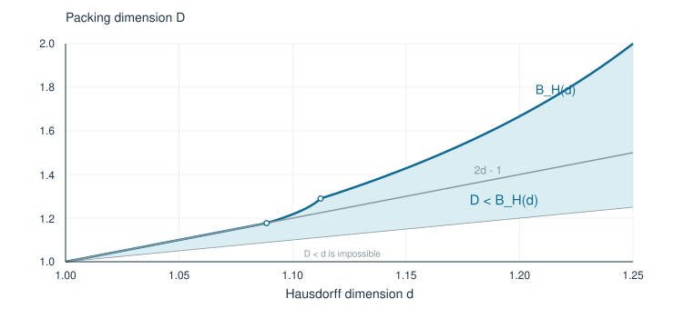

# A packing-dimension condition for positive pinned distances

[Read the focused proof PDF](falconer-packing-theorem.pdf).

This standalone document presents one theorem. The opening four pages give its
statement, graph, examples, proof idea, and assembly. Four appendices prove the
scale-selection bound and analytic estimates. Established results are cited
where used. It contains no Lean plan or exploratory extensions.

For a Borel set in the plane, write

$$
d=\dim_{\mathrm H}E,\qquad D=\dim_{\mathrm P}E.
$$

The theorem says

$$
1<d\le\frac54,\qquad D<B_{\mathrm H}(d)
\quad\Longrightarrow\quad
\exists y\in E:\quad
\mathcal L^1\bigl(\{|x-y|:x\in E\}\bigr)>0.
$$

Here

$$
B_{\mathrm H}(d)=
\begin{cases}
2d-1,&1<d\le d_\alpha,\\[5pt]
1+r_2(d-1),&d_\alpha<d\le d_c,\\[5pt]
\dfrac1{3-2d},&d_c<d\le\dfrac54,
\end{cases}
$$

$$
d_\alpha=\frac{7-\sqrt7}{4}\approx1.088562172,
\qquad d_c=\frac{2+\sqrt6}{4}\approx1.112372436,
$$

$$
r_2(a)=\frac{6a}
{2-a+8a^2+\sqrt{4-28a-63a^2+32a^3+64a^4}}.
$$



For example, at Hausdorff dimension 1.24 the theorem permits every packing
dimension strictly below 25/13 (approximately 1.92308). The simpler condition
requires packing dimension below 1.48.

The upper inequality is strict, including at Hausdorff dimension 5/4, where it
requires packing dimension below 2. This is a sufficient condition; necessity
and global optimality are not established.

The document is a natural-language proof dated 30 September 2026. The
repository subsequently completed a Lean formalization of this theorem;
the [main README](../../README.md#formal-proof-and-verification) links the
formal statement, independent comparator, and verification record. The older
conditional curve and the exploratory results in the research archive are
outside that compared claim. External human refereeing is not recorded.

The source headers and Git history identify Yongxi Lin as the author. Codex
assisted with the present submission preparation; the existing repository
does not document a complete historical AI contribution log or an independent
human statement review. [Palomar metadata](../../formalization.yaml) carries
the submission's contribution and review disclosures.

## Sources

The proof cites Orponen's [radial projection theorem](https://arxiv.org/abs/1710.11053),
Keleti and Shmerkin's [finite regularization and profile estimates](https://arxiv.org/abs/1801.08745v3),
Guth, Iosevich, Ou and Wang's [planar distance theorem and packet construction](https://arxiv.org/abs/1808.09346v1),
Liu's [pinned quadratic identity](https://arxiv.org/abs/1802.00350v3), and Liu's
[regular-pin packet localization](https://arxiv.org/abs/2603.15328v3).
The PDF gives the particular lemmas and propositions used. Its profile bounds
and variable-chain Fourier estimate are developed in the appendices.

## Rebuilding

Run from this directory:

```sh
tectonic -X compile falconer-packing-theorem.tex --outdir .
```

The vector figure is included in the repository. To regenerate it, run
`python3 plot_curve.py` with ReportLab installed.
