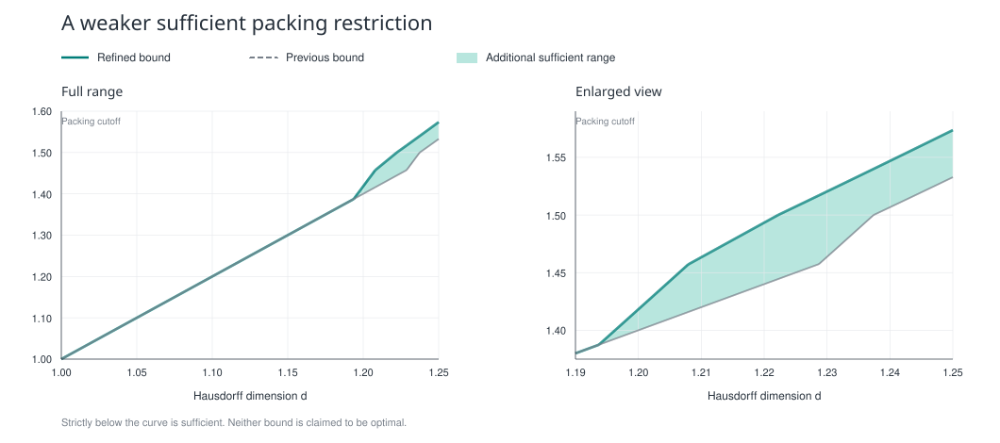

# A sharper sufficient condition

30 September 2026.

The [complete proof manuscript](packing-refinement-proof.pdf) improves the quoted
packing bound. It includes both analytic branches, the new scale-selection lemma,
the reduction to Borel sets, and a stronger conditional-energy convergence theorem.

For a Borel planar set, write

$$
d=\dim_H E,\qquad D=\dim_P E,
\qquad \Delta_y(E)=\{|x-y|:x\in E\}.
$$

Set

$$
d_* = \frac{13+\sqrt{41}}{16}\approx1.212695265,
\qquad
d_1 = \frac{5+\sqrt{97}}{12}\approx1.237404817.
$$

The refined sufficient condition is

$$
1<d\le\frac54,\qquad D<B_{\mathrm{new}}(d)
\quad\Longrightarrow\quad
\exists y\in E:\ |\Delta_y(E)|>0,
$$

where

$$
B_{\mathrm{new}}(d)=
\begin{cases}
2d-1,
  &1<d\le d_*,\\[4pt]
\dfrac{d(12d-7)}{2d+4},
  &d_*<d\le d_1,\\[8pt]
\dfrac{(2d-1)^2+\sqrt{(2d-1)^4+8d}}4,
  &d_1<d\le\dfrac54.
\end{cases}
$$

For example, the new condition covers

$$
d=\frac{61}{50}=1.22,\qquad D=\frac{289}{200}=1.445.
$$

The previous cutoff at this Hausdorff dimension was 1.44. The new cutoff and the
strict analytic exponent margin are

$$
B_{\mathrm{new}}(1.22)=\frac{11651}{8050}\approx1.447329193,
\qquad (d-1)-C(d,D)=\frac{3}{1952}>0.
$$

## Why the bound improves

The finite profile has lower slope constraint a and upper slope constraint b.
Above the mandatory midpoint, an affine upper envelope with slope one half is
tighter than the earlier upper bound. For

$$
0<a\le b\le\frac12,
$$

the new scale chain has cost at most

$$
\left(\frac{1+2b-4a}{8}+\frac{b-a}{2(1+a)}\right)N+O(T),
$$

with a bounded number of edges, the required curvature constraint, and a visit
to the midpoint. The Fourier argument pays this cost in the exponent. The new
middle cutoff follows by setting

$$
a=s-1,\qquad b=u-1,
\qquad
\frac{2u-4s+3}{8}+\frac{u-s}{2s}<s-1.
$$

The manuscript also improves the sufficient coherent energy summability condition to

$$
\sum_n Z_n^{(q-1)/q}<\infty,\qquad 1<q\le2,
$$

from the previous exponent

$$
\frac{q-1}{2q-1}.
$$

That improvement gives additional logarithmic endpoint criteria, but does not by
itself improve a condition involving only the two dimensions.

## What is established and what remains open

The manuscript supplies a mathematical proof using the explicitly cited established
analytic results. Separate internal checks covered the scale-selection lemma,
the Fourier transfer, the angular estimate, the algebra, and the exact example.
These checks are not external refereeing or Lean kernel verification.

The weakest possible condition remains unproved. No counterexample establishes
necessity of the new cutoff, and even the scale-selection upper bound has not been
proved optimal. For Hausdorff dimension greater than five quarters, GIOW already
gives a pin with positive-length distances without a packing restriction.

No Lean target or comparator definition was changed for this research update.
The new profile lemma and the unconditional analytic branches still need complete
Lean proofs using only standard axioms. A proof of an algebraic combination under
analytic hypotheses does not prove the unconditional theorem.

## Files

- [Proof PDF](packing-refinement-proof.pdf)
- [Main LaTeX source](packing-refinement-proof.tex)
- [New midpoint lemma](packing-refinement-profile-lemma.tex)
- [Full finite-profile analytic branch](packing-refinement-finite-profile.tex)
- [Original coherent analytic branch](packing-bound-original-branch.tex)
- [Coherent argument and independent midpoint audit](2026-09-30-coherent-audit.md)
- [Analytic transfer audit](2026-09-30-inflation-audit.md)
- [Profile optimization and its remaining limitations](2026-09-30-profile-optimization.md)

Compile the main LaTeX source from this directory; its figure is in the adjacent
`figures` directory.

The principal literature inputs are [Orponen](https://arxiv.org/abs/1710.11053),
[Keleti–Shmerkin](https://arxiv.org/abs/1801.08745),
[Guth–Iosevich–Ou–Wang](https://arxiv.org/abs/1808.09346),
[Liu's pinned identity](https://arxiv.org/abs/1802.00350), and
[Liu's 2026 regular-pin theorem](https://arxiv.org/abs/2603.15328).
